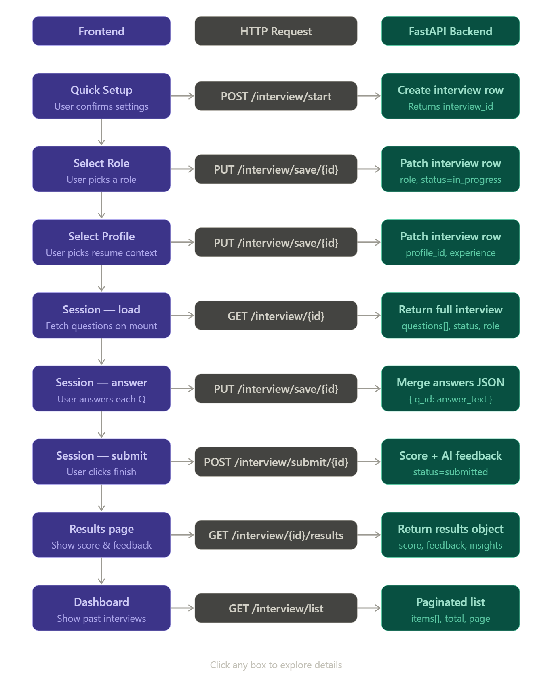

TalentPulseAI/
│
├── 📄 README.md                       (Project overview)
├── 📄 API_MANAGEMENT.md              (API architecture)
├── 📄 PROJECT_STRUCTURE.md           ✨ NEW - Complete structure
├── 📄 FLOW_DOCUMENTATION.md          (User flow & routing)
│
├── 📁 FastAPI-Backend/               (Python API)
│   ├── app/ (core, database, models, routes, services, schemas)
│   ├── alembic/ (migrations)
│   ├── requirements.txt (10 dependencies)
│   └── alembic.ini
│
├── 📁 Frontend/                      (React UI)
│   ├── src/ (app, components, contexts, services, lib, types)
│   ├── package.json (25+ dependencies)
│   ├── vite.config.ts, tsconfig.json
│   └── tailwind.config.js, eslint.config.js, etc.
│
└── 📁 NodeExpress-Backend/           (Empty placeholder)# TalentPulseAI API Management Documentation

**Last Updated**: March 29, 2026  
**Version**: 1.0.0  
**Status**: Implementation Guide

---

## Table of Contents

1. [Architecture Overview](#architecture-overview)
2. [Project Flow](#project-flow)
3. [Implementation Files](#implementation-files)
4. [API Endpoints](#api-endpoints)
5. [Usage Examples](#usage-examples)
6. [Error Handling](#error-handling)
7. [Best Practices](#best-practices)
8. [Migration Guide](#migration-guide)

---

## Architecture Overview

### Modern API Management Pattern

```
┌─────────────────────────────────────────────────────────────────┐
│                       FRONTEND LAYER                             │
├─────────────────────────────────────────────────────────────────┤
│                                                                   │
│  ┌──────────────────────────────────────────────────────────┐    │
│  │           React Components & Pages                        │    │
│  │  - LoginPage, RegisterPage, Interview, Dashboard         │    │
│  └──────────────────────────────────────────────────────────┘    │
│                            ↕                                      │
│  ┌──────────────────────────────────────────────────────────┐    │
│  │         Custom Hooks & Context                            │    │
│  │  - useAuth, useInterview, AuthProvider                   │    │
│  └──────────────────────────────────────────────────────────┘    │
│                            ↕                                      │
│  ┌──────────────────────────────────────────────────────────┐    │
│  │          Service Layer (Business Logic)                  │    │
│  │  - authService, interviewService, profileService        │    │
│  └──────────────────────────────────────────────────────────┘    │
└─────────────────────────────────────────────────────────────────┘
                             ↕
┌─────────────────────────────────────────────────────────────────┐
│              CENTRALIZED API MANAGEMENT LAYER                    │
├─────────────────────────────────────────────────────────────────┤
│                                                                   │
│  ┌──────────────────┐  ┌──────────────────┐  ┌─────────────┐   │
│  │  config.ts       │  │  httpClient.ts   │  │  types/api. │   │
│  │  (Endpoints,     │  │  (HTTP wrapper   │  │  (TypeScript│   │
│  │   URLs, Config)  │  │   + Interceptors)│  │   Types)    │   │
│  └──────────────────┘  └──────────────────┘  └─────────────┘   │
│                                                                   │
│  Features:                                                        │
│  ✓ Interceptors (Auth headers, error handling)                 │
│  ✓ Timeout management                                           │
│  ✓ Request/Response logging                                     │
│  ✓ Environment-based configuration                              │
│  ✓ Type-safe requests and responses                             │
│                                                                   │
└─────────────────────────────────────────────────────────────────┘
                             ↕
        ┌────────────────────────────────────────┐
        │      FastAPI Backend                    │
        │  - Auth endpoints                       │
        │  - Interview endpoints                  │
        │  - Profile endpoints                    │
        │  - Database (SQLAlchemy + PostgreSQL)  │
        └────────────────────────────────────────┘
```

---

## Project Flow

### Complete User Journey

```
START
  │
  ├─→ Landing Page (/)
  │     │ Authenticated? No
  │     └─→ Auth Routes
  │           │
  │           ├─→ Login (/auth/login)
  │           │     POST /auth/login
  │           │     ├─ Validate credentials
  │           │     ├─ Issue JWT token
  │           │     └─ Return user profile
  │           │     │
  │           │     └─→ Store Token in localStorage
  │           │           │
  │           ├─→ Register (/auth/register)
  │           │     POST /auth/register
  │           │     ├─ Validate input
  │           │     ├─ Create user in DB
  │           │     ├─ Issue JWT token
  │           │     └─ Auto-login (optional)
  │           │
  │     └─→ Redirect to /interview/quick-setup
  │
  ├─→ Interview Flow (/interview/*)
  │     │
  │     ├─→ Quick Setup (/interview/quick-setup)
  │     │     - Local state management
  │     │     - Collect basic info
  │     │     │
  │     │     └─→ POST /interview/start
  │     │           ├─ Create interview session in DB
  │     │           └─ Get interview_id
  │     │
  │     ├─→ Select Role (/interview/select-role)
  │     │     - Display role options
  │     │     - PUT /interview/save/{id}
  │     │       (Save progress)
  │     │
  │     ├─→ Select Profile (/interview/select-profile)
  │     │     - Display profile/resume
  │     │     - PUT /interview/save/{id}
  │     │       (Save progress)
  │     │
  │     └─→ Interview Session (AI Questions & Answers)
  │           - Real-time progress tracking
  │           - PUT /interview/save/{id}
  │             (Auto-save every answer)
  │           - Submitted? Yes
  │             │
  │             └─→ POST /interview/submit/{id}
  │                   ├─ Process answers
  │                   ├─ Calculate score
  │                   ├─ Generate results
  │                   └─ Mark as submitted
  │
  ├─→ Results View
  │     GET /interview/{id}/results
  │     ├─ Display score
  │     ├─ Show feedback
  │     └─ Show insights
  │
  ├─→ Dashboard (/dashboard)
  │     GET /interview/list
  │     ├─ Show all interviews
  │     ├─ Display scores
  │     └─ Ranking/stats
  │
  └─→ Profile Page (/profile)
        GET /user/profile
        GET /user/skills
        GET /user/education
        ├─ Display profile
        ├─ Manage skills
        ├─ Manage education
        └─ Upload documents

END
```

### API Call Flow Diagram

```
User Interaction
        │
        ↓
React Component
        │
        ↓
Custom Hook (useAuth, useInterview)
        │
        ↓
Service Layer (authService, interviewService)
        │
        ↓
Type Check (TypeScript Types)
        │
        ↓
HTTP Client (httpClient.ts)
        │
        ├─ Add Auth Header (interceptor)
        ├─ Set Timeout
        ├─ Stringify Body
        │
        ↓
Fetch API
        │
        ↓
Backend (FastAPI)
        │
        ├─ Validate JWT Token
        ├─ Process Request
        ├─ Database Query
        ├─ Generate Response
        │
        ↓
Response (JSON)
        │
        ├─ Parse JSON
        ├─ Apply Interceptors
        ├─ Type Check
        │
        ↓
Service Layer (return data)
        │
        ↓
Hook (state update)
        │
        ↓
Component Re-render
        │
        ↓
User Sees Update
```

---

## Implementation Files

### 1. **config.ts** - Environment & Endpoints Configuration

**Location**: `Frontend/src/lib/config.ts`

Centralized configuration containing:
- API base URL (environment-based)
- API timeout settings
- All endpoint paths organized by resource

```typescript
// Everything in one place - easy to update
export const config = {
  API_BASE_URL: "http://127.0.0.1:8000",
  API_TIMEOUT: 30000,
  ENDPOINTS: {
    AUTH: { LOGIN, REGISTER, REFRESH, LOGOUT, ME },
    INTERVIEW: { START, SAVE, GET, SUBMIT, RESULTS },
    PROFILE: { GET, UPDATE, UPLOAD },
    SKILLS: { LIST, ADD, UPDATE, DELETE },
    EDUCATION: { LIST, ADD, UPDATE, DELETE },
  }
}
```

**Benefits**:
- ✅ Single source of truth for endpoints
- ✅ Easy environment switching
- ✅ Type-safe endpoint usage

---

### 2. **types/api.ts** - Type Definitions

**Location**: `Frontend/src/types/api.ts`

Comprehensive TypeScript interfaces for:
- **Request Types**: LoginRequest, RegisterRequest, InterviewStartRequest
- **Response Types**: AuthResponse, InterviewResponse, ProfileResponse
- **Error Types**: ApiError, ApiErrorResponse
- **Utility Types**: PaginatedResponse, ApiResponse

```typescript
// Type-safe API calls
interface AuthResponse {
  access_token: string;
  token_type: "bearer";
  user: UserProfile;
}

// Catch errors at compile time, not runtime!
const response: AuthResponse = await authService.login(credentials);
```

**Benefits**:
- ✅ Compiler catches type errors
- ✅ IDE autocomplete for API responses
- ✅ Self-documenting API contracts
- ✅ Breaking changes detected early

---

### 3. **httpClient.ts** - HTTP Wrapper with Interceptors

**Location**: `Frontend/src/lib/httpClient.ts`

Advanced HTTP client featuring:
- **Automatic Auth Headers**: JWT token injection
- **Timeout Management**: Configurable timeouts with AbortController
- **Request/Response Interceptors**: Hooks for custom logic
- **Error Handling**: Centralized error parsing

```typescript
class HttpClient {
  // Interceptors for cross-cutting concerns
  addRequestInterceptor(fn) { /* add auth, logging, etc */ }
  addErrorInterceptor(fn) { /* centralized error handling */ }
  
  // All HTTP methods with timeout support
  get<T>(endpoint) { /* ... */ }
  post<T>(endpoint, data) { /* ... */ }
  put<T>(endpoint, data) { /* ... */ }
  delete<T>(endpoint) { /* ... */ }
}
```

**Benefits**:
- ✅ Auto-inject JWT token on every request
- ✅ Centralized error handling and logging
- ✅ Request timeout protection
- ✅ Retry logic support (can be added)
- ✅ Easy to mock for testing

---

### 4. **authService.ts** - Authentication Service

**Location**: `Frontend/src/services/authService.ts`

High-level authentication operations:
- `login()` - Authenticate user
- `register()` - Create new account
- `logout()` - End session
- `refreshToken()` - Get new token
- `getCurrentUser()` - Fetch user profile
- `isAuthenticated()` - Check auth status
- `getToken()` - Get stored JWT token

```typescript
// Clean, readable authentication flow
const response = await authService.login({ email, password });
authService.setToken(response.access_token);

// Token automatically added to future requests
```

**Benefits**:
- ✅ Separation of concerns
- ✅ Reusable across components
- ✅ Centralized token management
- ✅ No duplicate auth logic

---

### 5. **interviewService.ts** - Interview Management Service

**Location**: `Frontend/src/services/interviewService.ts`

Interview-specific operations:
- `startInterview()` - Create new interview
- `saveProgress()` - Auto-save progress
- `submitInterview()` - Submit completed interview
- `getInterview()` - Fetch interview details
- `getResults()` - Get interview results
- `isInterviewValid()` - Check if interview is active
- `calculateProgress()` - Get completion percentage

```typescript
// Start interview and track progress
const interview = await interviewService.startInterview({
  user_id: "123",
  role: "backend-engineer"
});

// Auto-save progress
await interviewService.saveProgress(interview.id, {
  current_question: 5,
  answers: { q1: "answer1", q2: "answer2" }
});
```

**Benefits**:
- ✅ Business logic separated from UI
- ✅ Easy to test interview logic
- ✅ Reusable across components
- ✅ Single source for interview operations

---

### 6. **.env.local** - Environment Variables

**Location**: `Frontend/.env.local`

```env
VITE_API_URL=http://127.0.0.1:8000
VITE_API_TIMEOUT=30000
VITE_APP_NAME=TalentPulseAI
VITE_DEBUG_MODE=true
```

**Benefits**:
- ✅ Different configs for dev/staging/prod
- ✅ Secure - not committed to git
- ✅ Easy to update without code changes
- ✅ Build-time configuration injection

---

## API Endpoints

### Authentication Endpoints

```
POST /auth/register
├─ Request: { email, password, full_name, phone? }
├─ Response: { access_token, token_type, user }
└─ Usage: authService.register()

POST /auth/login
├─ Request: { email, password }
├─ Response: { access_token, token_type, user }
└─ Usage: authService.login()

POST /auth/refresh
├─ Request: (empty, uses current token)
├─ Response: { access_token, token_type, user }
└─ Usage: authService.refreshToken()

GET /auth/me
├─ Headers: Authorization: Bearer {token}
├─ Response: UserProfile
└─ Usage: authService.getCurrentUser()

POST /auth/logout
├─ Headers: Authorization: Bearer {token}
├─ Response: { message: "Logged out" }
└─ Usage: authService.logout()
```

### Interview Endpoints

```
POST /interview/start
├─ Request: { user_id, role, profile_id? }
├─ Response: InterviewResponse
└─ Usage: interviewService.startInterview()

PUT /interview/save/{id}
├─ Request: { data: { question_id, answer } }
├─ Response: InterviewResponse
└─ Usage: interviewService.saveProgress()

GET /interview/{id}
├─ Response: InterviewResponse
└─ Usage: interviewService.getInterview()

GET /interview/list?page=1&page_size=10
├─ Response: PaginatedResponse<InterviewResponse>
└─ Usage: interviewService.listInterviews()

POST /interview/submit/{id}
├─ Request: { answers: {}, completed_at }
├─ Response: InterviewResponse (status: "submitted")
└─ Usage: interviewService.submitInterview()

GET /interview/{id}/results
├─ Response: { score, feedback, insights }
└─ Usage: interviewService.getResults()
```

### Profile Endpoints

```
GET /user/profile
├─ Response: ProfileResponse { user, skills, education, documents }
└─ Usage: profileService.getProfile()

PUT /user/profile/update
├─ Request: { bio?, title?, company?, location? }
├─ Response: ProfileResponse
└─ Usage: profileService.updateProfile()

POST /user/profile/upload
├─ Request: FormData (file)
├─ Response: { url, type, size }
└─ Usage: profileService.uploadDocument()
```

---

## Usage Examples

### Example 1: Login Flow

```typescript
// In Component or Hook
import { useAuth } from "@/contexts/auth-context";

export function LoginPage() {
  const { login, isLoading } = useAuth();
  const [email, setEmail] = useState("");
  const [password, setPassword] = useState("");
  const [error, setError] = useState("");

  const handleLogin = async (e: React.FormEvent) => {
    e.preventDefault();
    try {
      // Service handles all API details
      await login(email, password);
      // Redirect happens in hook
    } catch (err) {
      setError(err.message);
    }
  };

  return (
    <form onSubmit={handleLogin}>
      <input value={email} onChange={(e) => setEmail(e.target.value)} />
      <input value={password} onChange={(e) => setPassword(e.target.value)} />
      <button disabled={isLoading}>Login</button>
      {error && <p className="error">{error}</p>}
    </form>
  );
}
```

### Example 2: Interview Progress Auto-Save

```typescript
// In Interview Component
import { interviewService } from "@/services/interviewService";

export function InterviewSession({ interviewId }) {
  const [answers, setAnswers] = useState({});

  const handleAnswer = async (questionId, answer) => {
    const newAnswers = { ...answers, [questionId]: answer };
    setAnswers(newAnswers);

    // Auto-save with debounce (use useCallback + hook)
    try {
      await interviewService.saveProgress(interviewId, {
        answers: newAnswers,
        timestamp: new Date().toISOString(),
      });
    } catch (error) {
      console.error("Auto-save failed (user not notified):", error);
      // Don't interrupt user with error
    }
  };

  return (
    <div>
      {questions.map((q) => (
        <QuestionCard
          key={q.id}
          question={q}
          onAnswer={(answer) => handleAnswer(q.id, answer)}
        />
      ))}
    </div>
  );
}
```

### Example 3: Direct Service Usage (No Hook)

```typescript
// Direct service usage for custom logic
import { authService } from "@/services/authService";
import { interviewService } from "@/services/interviewService";

async function getUserAndInterviews() {
  // Check authentication
  if (!authService.isAuthenticated()) {
    redirect("/auth/login");
  }

  // Get user ID
  const userId = authService.getUserId();

  // Fetch interviews
  const interviews = await interviewService.listInterviews();

  // Get results of first interview
  if (interviews.items.length > 0) {
    const results = await interviewService.getResults(interviews.items[0].id);
    console.log("User Score:", results.score);
  }
}
```

### Example 4: Error Handling

```typescript
import { httpClient } from "@/lib/httpClient";
import type { ApiError } from "@/types/api";

// Add global error interceptor
httpClient.addErrorInterceptor((error: ApiError) => {
  // Log to analytics
  console.error(`API Error: ${error.status} - ${error.detail}`);

  // Handle specific errors
  if (error.status === 401) {
    // Token expired - redirect to login
    window.location.href = "/auth/login";
  } else if (error.status === 422) {
    // Validation error - show to user
    showToast("Invalid input: " + error.detail, "error");
  } else if (error.status >= 500) {
    // Server error
    showToast("Server error. Please try again later.", "error");
  }

  return error;
});
```

---

## Error Handling

### Error Types

```typescript
// API Error Response
interface ApiError {
  status: number;           // HTTP status code
  detail: string;           // Error message
  timestamp: string;        // When error occurred
  path?: string;            // Request path
}

// Validation Error Format (from FastAPI)
interface ApiErrorDetail {
  loc: (string | number)[]; // Field location
  msg: string;              // Error message
  type: string;             // Error type
}
```

### Error Handling Strategy

```typescript
try {
  const response = await authService.login({ email, password });
  // ✅ Success - access response.access_token
} catch (error) {
  const apiError = error as ApiError;
  
  switch (apiError.status) {
    case 401:
      showError("Invalid email or password");
      break;
    case 409:
      showError("Email already exists");
      break;
    case 422:
      showError("Invalid input format");
      break;
    case 500:
      showError("Server error. Please try again later.");
      break;
    default:
      showError(apiError.detail || "An error occurred");
  }
}
```

---

## Best Practices

### 1. ✅ Always use Services, not direct httpClient

```typescript
// ❌ DON'T - Direct HTTP calls scattered
const response = await httpClient.post("/auth/login", credentials);

// ✅ DO - Use service layer
const response = await authService.login(credentials);
```

### 2. ✅ Use Type-Safe Imports

```typescript
// ❌ DON'T - String literals for endpoints
const url = "/auth/login";

// ✅ DO - Use config
import { config } from "@/lib/config";
const url = config.ENDPOINTS.AUTH.LOGIN;
```

### 3. ✅ Handle Errors Appropriately

```typescript
// ❌ DON'T - Swallow all errors
try {
  await api.call();
} catch (e) {
  console.log("Error happened");
}

// ✅ DO - Handle specific errors
try {
  await api.call();
} catch (error) {
  const apiError = error as ApiError;
  if (apiError.status === 401) {
    authService.logout();
  } else {
    showErrorToast(apiError.detail);
  }
}
```

### 4. ✅ Use Environment Variables

```typescript
// ❌ DON'T - Hard-coded URLs
const api = "http://127.0.0.1:8000";

// ✅ DO - Environment-based
const api = import.meta.env.VITE_API_URL;
```

### 5. ✅ Leverage Type Safety

```typescript
// ❌ DON'T - Any type
const response: any = await api.call();

// ✅ DO - Specific types
const response: AuthResponse = await authService.login(credentials);
```

---

## Migration Guide

### From Current Implementation to Modern Pattern

### Step 1: Create New Files
```bash
✅ Create: Frontend/src/lib/config.ts
✅ Create: Frontend/src/types/api.ts
✅ Create: Frontend/src/lib/httpClient.ts
✅ Create: Frontend/src/services/authService.ts
✅ Create: Frontend/src/services/interviewService.ts
✅ Create: Frontend/.env.local
```

### Step 2: Update Auth Context

**Before** (Old Pattern):
```typescript
const API = "http://127.0.0.1:8000";
const login = async (email, password) => {
  const res = await fetch(`${API}/auth/login`, {
    method: "POST",
    headers: { "Content-Type": "application/json" },
    body: JSON.stringify({ email, password }),
  });
  // ... error handling ...
};
```

**After** (New Pattern):
```typescript
import { authService } from "@/services/authService";

const login = async (email: string, password: string) => {
  const response = await authService.login({ email, password });
  setToken(response.access_token);
  navigate("/interview/quick-setup");
};
```

### Step 3: Update Components

**Before**:
```typescript
const response = await fetch("http://127.0.0.1:8000/interview/start", {
  method: "POST",
  headers: {
    "Content-Type": "application/json",
    "Authorization": `Bearer ${token}`,
  },
  body: JSON.stringify({ role, profile_id }),
});
```

**After**:
```typescript
import { interviewService } from "@/services/interviewService";

const interview = await interviewService.startInterview({
  user_id,
  role,
  profile_id,
});
```

### Step 4: Test

```bash
# Run tests to ensure everything works
npm run test

# Start dev server
npm run dev

# Test login flow
# Test interview flow
# Test error scenarios
```

---

## Quick Reference

### Import Statements

```typescript
// Configuration
import { config, buildUrl } from "@/lib/config";

// Types
import type { AuthResponse, InterviewResponse, ApiError } from "@/types/api";

// HTTP Client
import { httpClient } from "@/lib/httpClient";

// Services
import { authService } from "@/services/authService";
import { interviewService } from "@/services/interviewService";

// Hooks
import { useAuth } from "@/contexts/auth-context";
```

### Common Operations

```typescript
// Login
await authService.login({ email, password });

// Check Authentication
authService.isAuthenticated();

// Get Current User
const user = authService.getCurrentUserFromStorage();

// Start Interview
const interview = await interviewService.startInterview({
  user_id: "123",
  role: "backend-engineer",
});

// Save Progress
await interviewService.saveProgress(interview.id, { answers });

// Submit Interview
await interviewService.submitInterview(interview.id, {
  answers,
  completed_at: new Date().toISOString(),
});

// Get Interview Results
const results = await interviewService.getResults(interview.id);
```

---

## Summary

### Why This Pattern?

| Aspect | Old Way | New Way | Benefit |
|--------|---------|---------|---------|
| **API URLs** | Hard-coded everywhere | Single config file | Easy to change, no bugs |
| **Type Safety** | `any` type | Full TypeScript | Errors caught early |
| **Error Handling** | Duplicated in each call | Centralized | Consistent behavior |
| **Auth Token** | Manual header injection | Auto-injected | No forgotten tokens |
| **Testing** | Hard to mock | Mock one service | Much easier |
| **Maintenance** | Scattered API logic | Organized in services | Better structure |
| **New Features** | Repeat same patterns | Add to service | DRY principle |

### Files Created

✅ **6 new files** implementing the modern API management pattern  
✅ **Type-safe** API calls with full TypeScript support  
✅ **Centralized** configuration and error handling  
✅ **Scalable** architecture for future features  
✅ **Enterprise-ready** with interceptors and logging

---

## Next Steps

1. **Update React Context** to use new services
2. **Migrate Components** to use services instead of direct fetch calls
3. **Create Backend Endpoints** for interview persistence
4. **Add Unit Tests** for services
5. **Set Up CI/CD** with environment-based builds

---

**Document Version**: 1.0.0  
**Created**: March 29, 2026  
**Maintained By**: Development Team


