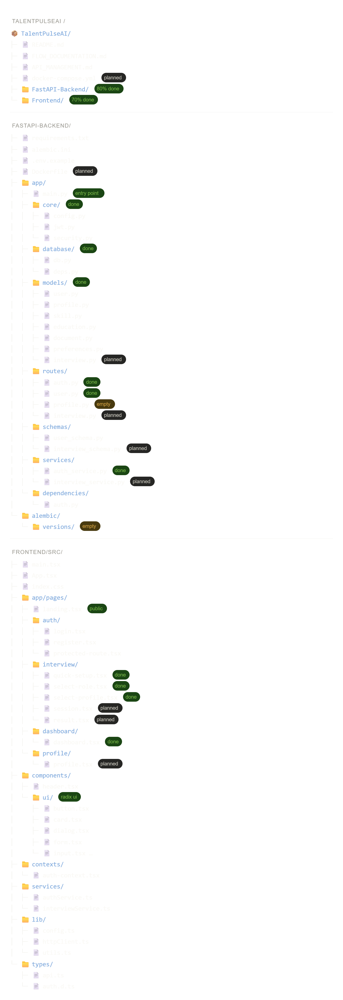

# TalentPulseAI - User Flow Documentation

## Overall User Journey

```
┌─────────────────┐
│ Landing Page    │ (/)  - PUBLIC - No auth required
└────────┬────────┘
         │
         ├─ "Login" → /auth/login
         └─ "Get Started Free" → /auth/register
         │
         ├─ /auth/login         - PUBLIC - Login form
         └─ /auth/register      - PUBLIC - Registration form
         │
         ▼ (After successful login/registration)
┌─────────────────────────────────┐
│ Interview Flow Begins           │ - PROTECTED (requires authentication)
└─────────────────────────────────┘
         │
         ▼
┌─────────────────────────────────┐
│ 1. QUICK-SETUP                  │ (/interview or /interview/quick-setup)
│ - Setup interview parameters    │
│ - Select difficulty level        │ 
│ - Confirm settings              │
└────────┬────────────────────────┘
         │
         ▼ (After Quick-Setup)
┌─────────────────────────────────┐
│ 2. SELECT-ROLE                  │ (/interview/select-role)
│ - Choose interview role         │
│ - e.g., Backend Dev, Frontend   │
│ - etc.                           │
└────────┬────────────────────────┘
         │
         ▼ (After Role Selection)
┌─────────────────────────────────┐
│ 3. SELECT-PROFILE               │ (/interview/select-profile)
│ - Choose profile/resume context │
│ - AI tailors questions based on │
│   user experience               │
└────────┬────────────────────────┘
         │
         ▼ (After Profile Selection)
┌─────────────────────────────────┐
│ 4. INTERVIEW SESSION            │ (Planned: /interview/session)
│ - AI-generated questions        │
│ - Video/Audio recording         │
│ - Real-time analysis            │
└────────┬────────────────────────┘
         │
         ▼ (After Interview Completion)
┌─────────────────────────────────┐
│ 5. INTERVIEW RESULT/REPORT      │ (Planned: /interview/result)
│ - Performance score             │
│ - Strengths & Weaknesses        │
│ - AI Feedback & Tips            │
└────────┬────────────────────────┘
         │
         ▼ (View Report or Start New Interview)
┌─────────────────────────────────┐
│ DASHBOARD                       │ (/dashboard)
│ - Interview history             │
│ - Performance analytics         │
│ - View all reports              │
│ - Start new interviews          │
└─────────────────────────────────┘
         │
         ▼
┌─────────────────────────────────┐
│ PROFILE (Upcoming)              │ (/profile)
│ - User settings                 │
│ - Manage resume/experience      │
│ - Account preferences           │
└─────────────────────────────────┘
```

## Route Configuration

### Public Routes (No Authentication Required)
- `GET /` - Landing Page
- `GET /auth/login` - Login Page
- `GET /auth/register` - Registration Page
- `GET *` - Redirects to `/auth/login` (fallback)

### Protected Routes (Authentication Required)
All routes below require valid JWT token in localStorage as `access_token`

#### Interview Flow (Protected)
- `GET /interview` → Redirects to `/interview/quick-setup`
- `GET /interview/quick-setup` - Quick Setup Page (Interview Entry Point)
- `GET /interview/select-role` - Role Selection Page
- `GET /interview/select-profile` - Profile Selection Page
- `GET /interview/session` - Interview Session Page (Planned)
- `GET /interview/result` - Interview Results Page (Planned)

#### Dashboard & Profile (Protected)
- `GET /dashboard` - Dashboard Home Page
- `GET /profile` - User Profile Page (Upcoming)

## Authentication Flow

### Login Flow
1. User clicks "Login" on landing page
2. User navigates to `/auth/login`
3. Enters email and password
4. System validates credentials with backend API (`POST /auth/login`)
5. Backend returns `access_token`
6. Token stored in `localStorage` as `access_token`
7. User automatically redirected to `/interview/quick-setup` ✅

### Registration Flow
1. User clicks "Get Started Free" on landing page
2. User navigates to `/auth/register`
3. Enters name, email, phone, password
4. System creates account with backend API (`POST /auth/register`)
5. System automatically logs in user (calls login API)
6. Token stored in `localStorage`
7. User automatically redirected to `/interview/quick-setup` ✅

### Logout Flow
1. User clicks logout (in dashboard or profile)
2. Token removed from `localStorage`
3. User redirected to `/auth/login`
4. Cannot access protected routes without login

## Protected Route Behavior

All routes under `/interview`, `/dashboard`, and `/profile` use the `ProtectedRoute` component:

```tsx
<ProtectedRoute>
  <PageComponent />
</ProtectedRoute>
```

**What ProtectedRoute does:**
- ✅ If user is authenticated: Shows the page
- ❌ If user is NOT authenticated: Redirects to `/auth/login`
- ⏳ While checking auth status: Shows loading spinner

## Key Changes Made

1. **Fixed Interview Entry Point**
   - `/interview` now shows `QuickSetup` (previously showed `SelectRole`)
   - `/interview/quick-setup` also available as alternate path

2. **Updated Route Order**
   - Interview routes now in logical flow: quick-setup → select-role → select-profile
   - All interview routes are protected

3. **Updated Auth Redirect**
   - After login/registration, users now go to `/interview/quick-setup` (not `/dashboard`)
   - This ensures users start with interview setup before accessing dashboard

4. **Added Security**
   - All interview pages require authentication
   - Users cannot bypass login to access interview routes
   - Fallback route redirects to login page

## Environment Configuration

**Backend API Base URL:** `http://127.0.0.1:8000`

**Auth Endpoints:**
- `POST /auth/login` - Login with email & password
- `POST /auth/register` - Register with username, email, phone, password

## Related Files

- [App.tsx](../Frontend/src/App.tsx) - Main routing configuration
- [auth-context.tsx](../Frontend/src/contexts/auth-context.tsx) - Authentication state management
- [protected-route.tsx](../Frontend/src/app/pages/auth/protected-route.tsx) - Route protection component
- [landing.tsx](../Frontend/src/app/pages/landing.tsx) - Landing/home page
